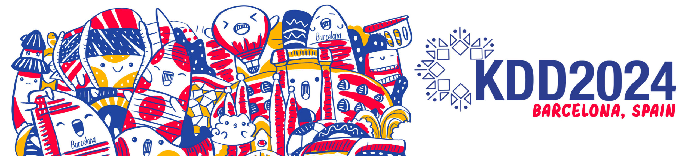

# Contrastive Learning for Foundation Models and Beyond



This site is the official site for KDD 2024 tutorial on Heterogeneous Contrastive Learning for Foundation Models and Beyond.

- Time: 10:00 AM – 1:00 PM, Sunday, August 25th, 2024
- Place: Barcelona, Spain


<p align="center">
      
</p>


## Audience and Topic
The tutorial is designed for anyone with basic knowledge of machine learning and artificial intelligence. This tutorial will provide the audience with the basic concept of heterogeneous contrastive learning and how contrastive learning is applied to train and fine-tune the foundation models for view and task heterogeneity. After attending this tutorial, the audience will be familiar with the mechanism of contrastive learning in many domains, such as text mining, image recognition, etc.


## Agenda (slides will be added soon)

**Opening Remark**

1. **Overview of contrastive learning** (Lecheng Zheng, 20min)  
2. **Contrastive Learning with View Heterogeneity** (65min)  
    - Contrastive Learning Basis (Lecheng Zheng)
    - Contrastive Foundation Models (vision models, language models,  multi-modal models, etc. Zihao Li)

  **Coffee Break** (15min)

3. **Contrastive Learning with Task Heterogeneity** (60min)  
    - Pre-training tasks (Pretext tasks, supervised tasks, preference tasks, etc. Lecheng Zheng)
    - Downstream tasks (Zihao Li)
4. **Open Challenges and Future Directions** (10min)
5. **Q&A** (10min)


## Material
```
@article{DBLP:journals/corr/abs-2404-00225,
  author       = {Lecheng Zheng and
                  Baoyu Jing and
                  Zihao Li and
                  Hanghang Tong and
                  Jingrui He},
  title        = {Heterogeneous Contrastive Learning for Foundation Models and Beyond},
  journal      = {CoRR},
  volume       = {abs/2404.00225},
  year         = {2024},
  url          = {https://doi.org/10.48550/arXiv.2404.00225},
  doi          = {10.48550/ARXIV.2404.00225},
  eprinttype    = {arXiv},
  eprint       = {2404.00225},
  timestamp    = {Wed, 08 May 2024 17:22:41 +0200},
  biburl       = {https://dblp.org/rec/journals/corr/abs-2404-00225.bib},
  bibsource    = {dblp computer science bibliography, https://dblp.org}
}
```
